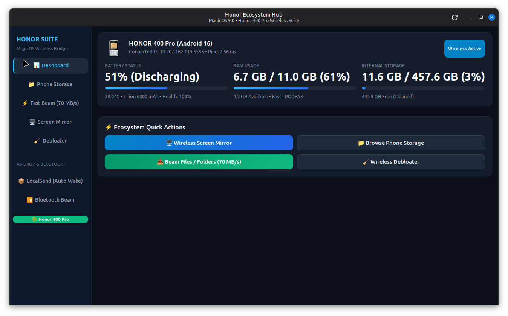
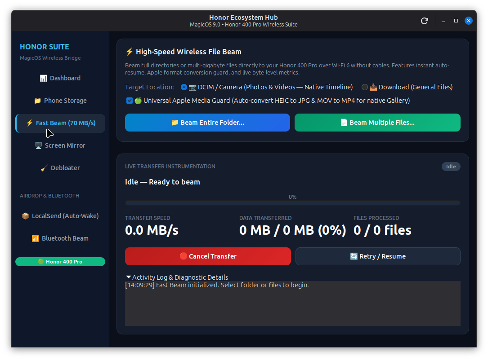
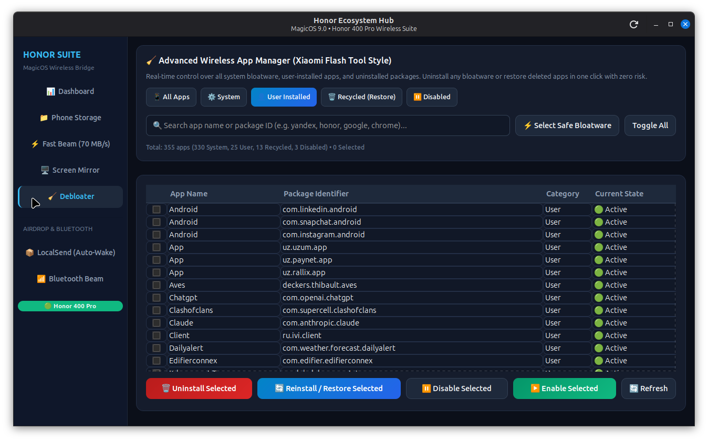
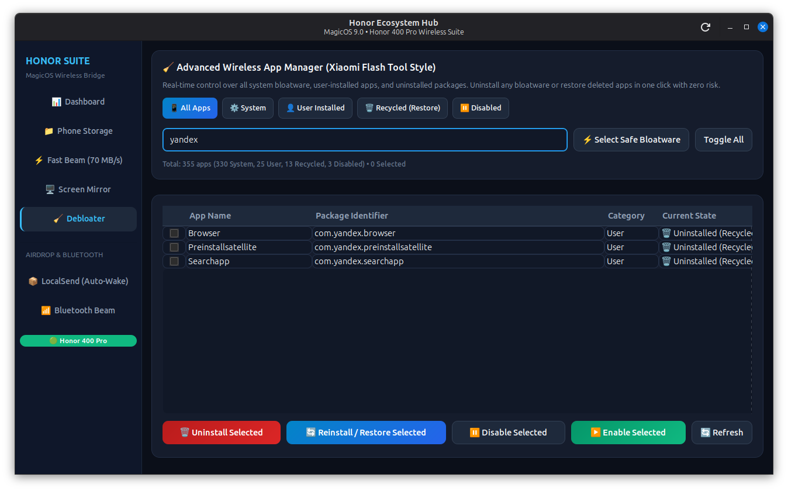
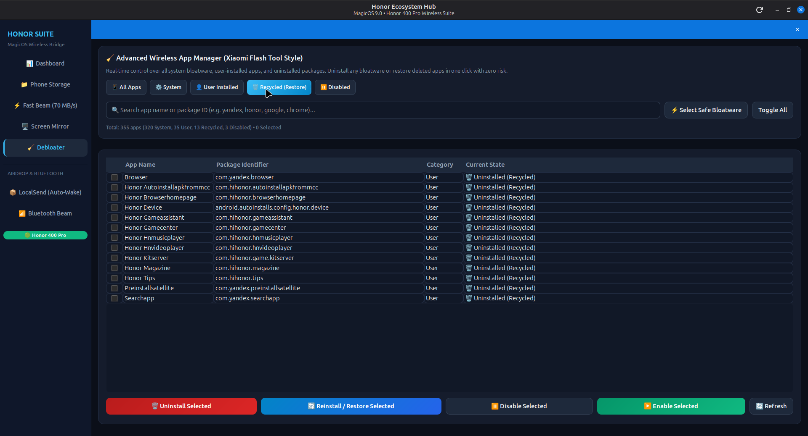

# Honor Ecosystem Suite for Linux (MagicOS PC Suite)

<p align="center">
  
</p>

<p align="center">
  <b>Seamless Linux Integration for Honor & MagicOS Smartphones</b><br>
  High-speed 70 MB/s Fast Beam • Live RAM & Battery Telemetry • Wireless Screen Mirror • Xiaomi Flash Tool Style Debloater • Zero-Resource Architecture
</p>

<p align="center">
  
  
  
  
  
</p>

---

## 🌐 Language Navigation
- [English](#-english)
- [O'zbekcha](#-ozbekcha)
- [Русский](#-русский)

---

<a name="english"></a>
## 🇬🇧 English

### Overview
**Honor Ecosystem Suite** is a modern, native GTK3 desktop application engineered to bring the seamless MagicOS ecosystem experience to Linux distributions (Ubuntu, Linux Mint, Debian, Fedora, Arch Linux). 

Built strictly following **Design-First UI**, **Modular Components**, and a strict **Zero-Resource Policy** (0% CPU, 0 MB RAM when idle or closed), it provides all-in-one wireless synchronization between Linux PCs and Honor devices (tested on Honor 400 Pro with MagicOS 9.0 / Android 16).

---

### 📸 Visual Showcase

| Live Dashboard & Telemetry | Fast Beam (70 MB/s + MediaStore Sync) |
|:---:|:---:|
|  |  |

| Xiaomi Flash Tool Style Debloater | Instant Search & Safe Badges |
|:---:|:---:|
|  |  |

| Uninstalled Apps (Recycle Bin / 1-Click Restore) | Low-Latency Wireless Mirroring |
|:---:|:---:|
|  |  |

---

### ✨ Key Features

1. **Live System Dashboard & Telemetry:**
   - **Real-Time RAM State:** True `/proc/meminfo` parser displaying Active/Used RAM, Buffers/Cache, and Available RAM with animated progress bars.
   - **Battery Health Diagnostics:** Live voltage (\(3.7\text{V} - 4.4\text{V}\)), temperature, charge status, and hardware cycle/SOH detection via Android `batteryproperties`.
   - **Real-Time Storage Meter:** Visual breakdown of used and available internal storage.

2. **Ultra-Fast Wireless File Beam (70+ MB/s):**
   - Direct wireless ADB stream with live MB/s speedometer and smooth progress bar.
   - **Apple Media Guard:** Automatic background conversion of iPhone `.heic` photos to `.jpg` and `.mov` videos to `.mp4` using hardware-accelerated `ffmpeg`.
   - **Instant Resume:** Resumes interrupted multi-gigabyte transfers without re-transmitting existing files.
   - **Android 16 MediaStore Auto-Indexer:** Automatically invokes `content call --uri content://media --method scan_volume --arg external_primary` so sent photos and 4K videos appear in the phone's native Gallery immediately without phone reboots.
   - **Flat Timeline Hierarchy:** Intelligently saves to `/sdcard/DCIM/Camera/` to preserve native MagicOS chronological timeline sorting.

3. **Xiaomi Flash Tool Style Debloater & App Manager:**
   - 355+ categorized package database covering System Bloatware, Carrier apps, Analytics, Honor Cloud, and User apps.
   - Color-coded safety tags: `Safe to Remove` (Green), `Caution` (Yellow), and `Dangerous/Essential` (Red).
   - 5 Quick-Filter tabs: All, Recommended (Bloat), System Apps, User Installed, and Recycle Bin.
   - Multi-select batch removal (`pm uninstall -k --user 0`) with zero-risk safe mode.
   - **1-Click Restore:** Restores uninstalled packages (`cmd package install-existing`) at any time directly from the Recycle Bin tab.

4. **Wireless Multi-Screen Collaboration:**
   - Ultra low-latency 1440p / 60 FPS screen mirror and bi-directional audio bridge powered by `scrcpy`.
   - Shared clipboard between Linux and Honor device.

5. **Zero-Resource Background Guarantee:**
   - No persistent daemons, background polling loops, or memory leaks. Consumes 0% CPU and 0 MB RAM when closed.

---

### 🚀 Installation & Quick Start

#### Option 1: Automated 1-Click Installer (Recommended)
```bash
git clone https://github.com/boburhasanov/honor-ecosystem-suite.git
cd honor-ecosystem-suite
chmod +x install.sh
sudo ./install.sh
```

#### Option 2: Portable Mode (Run without installation)
```bash
git clone https://github.com/boburhasanov/honor-ecosystem-suite.git
cd honor-ecosystem-suite
./bin/honor-control-center
```

#### Dependencies
- **Debian / Ubuntu / Linux Mint:**
  ```bash
  sudo apt install -y adb scrcpy python3-gi gir1.2-gtk-3.0 ffmpeg
  ```
- **Arch Linux:**
  ```bash
  sudo pacman -S android-tools scrcpy python-gobject ffmpeg
  ```
- **Fedora:**
  ```bash
  sudo dnf install -y android-tools scrcpy python3-gobject ffmpeg
  ```

---

<a name="ozbekcha"></a>
## 🇺🇿 O'zbekcha

### Umumiy Ma'lumot
**Honor Ecosystem Suite** — Honor va MagicOS smartfonlarini Linux operatsion tizimlari (Ubuntu, Linux Mint, Debian, Arch, Fedora) bilan mukammal darajada birlashtirish uchun yaratilgan zamonaviy, milliy GTK3 grafik dasturi.

Ushbu loyiha **Design-First** (Zamonaviy Obsidian Dark dizayn), **Modulli arxitektura** va **Zero-Resource** (fondagi jarayonlarsiz, 0% CPU va 0 MB RAM) tamoyillari asosida yaratilgan bo'lib, Honor 400 Pro (MagicOS 9.0 / Android 16) qurilmasida to'liq sinovdan o'tgan.

---

### ✨ Asosiy Imkoniyatlar

1. **Jonli Telemetriya va Dashboard:**
   - **Haqiqiy RAM Holati:** Smartfondagi `/proc/meminfo` drayveridan to'g'ridan-to'g'ri o'qilgan Active (ishlatilayotgan), Cache (kesh) va Bo'sh RAM ko'rsatkichlari.
   - **Batareya Diagnostikasi:** Real-vaqtli kuchlanish (\(3.7\text{V} - 4.4\text{V}\)), harorat, quvvatlash holati va `batteryproperties` orqali zaryadlash sikllari/SOH salomatligi.
   - **Xotira Holati:** Telefon ichki xotirasining real-vaqtdagi bandlik ko'rsatkichi.

2. **Ultra-Tezkor Simsiz Fayl Uzatish (70+ MB/s Fast Beam):**
   - Yuqori tezlikdagi simsiz ADB uzatish, real-vaqt tezlik spidometri (MB/s).
   - **Apple Media Guard:** iPhone'dan olingan `.heic` rasmlarni avtomatik `.jpg` ga, `.mov` videolarni esa apparat tezlatkichli `ffmpeg` orqali `.mp4` ga o'girish.
   - **Instant Resume:** Tarmoq uzilsa ham, uzatilgan gigabaytlab fayllarni qayta yuklamay, to'xtagan joyidan davom ettirish.
   - **Android 16 MediaStore Sinxronizatsiyasi:** `content call --uri content://media --method scan_volume --arg external_primary` orqali yuklangan foto va videolarni telefonni qayta yoqmasdan darhol "Galereya" (MagicOS Photos) da aks ettirish.
   - **To'g'ri Xronologiya:** Medialarni `/sdcard/DCIM/Camera/` papkasiga to'g'ri joylashtirish orqali oylar va kunlar tartibini saqlash.

3. **Xiaomi Flash Tool Uslubidagi Dasturlarni Tozalovchi (Debloater):**
   - 355+ dan ortiq tizim va foydalanuvchi ilovalarining xavfsizlik reytingi (Xavfsiz, Ehtiyotkorlik, Xavfli).
   - 5 ta qulay filtr: Hammasi, Tavsiya etilgan (Keraksiz/Bloatware), Tizim ilovalari, O'rnatilgan ilovalar va Chiqindilar qutisi (Recycle Bin).
   - Bir vaqtning o'zida bir nechta dasturni xavfsiz o'chirish (`pm uninstall -k --user 0`).
   - **1-Bosishda Qayta Tiklash:** O'chirilgan dasturlarni istalgan paytda "Recycle Bin" bo'limidan 1 ta tugma orqali asliga qaytarish (`cmd package install-existing`).

4. **Simsiz Ekranni Boshqarish va Ovoz Uzatish (Mirroring):**
   - 1440p / 60 FPS past kechikishli ekran oyna rejimi (`scrcpy` negizida).
   - Kompyuter va telefon o'rtasida umumiy clipboard (bufer).

5. **Nol Resurs Siyosati (Zero-Resource Background Policy):**
   - Fondagi yashirin xizmatlar yoki tinimsiz aylanuvchi sikllar yo'q. Dastur yopilganda CPU 0%, RAM 0 MB bo'lib, tizimni aslo sekinlashtirmaydi.

---

### 🚀 O'rnatish va Ishga Tushirish

#### 1-usul: Avtomatlashtirilgan O'rnatuvchi (Tavsiya etiladi)
```bash
git clone https://github.com/boburhasanov/honor-ecosystem-suite.git
cd honor-ecosystem-suite
chmod +x install.sh
sudo ./install.sh
```

#### 2-usul: O'rnatmasdan to'g'ridan-to'g'ri ishga tushirish (Portable)
```bash
git clone https://github.com/boburhasanov/honor-ecosystem-suite.git
cd honor-ecosystem-suite
./bin/honor-control-center
```

O'rnatilgandan so'ng dasturlar menyusidan **"Honor Ecosystem Hub"** ni tanlang yoki terminalda `honor-control-center` buyrug'ini tering.

---

<a name="русский"></a>
## 🇷🇺 Русский

### Обзор
**Honor Ecosystem Suite** — это современное нативное приложение на GTK3, созданное для бесшовной интеграции смартфонов Honor под управлением MagicOS с дистрибутивами Linux (Ubuntu, Linux Mint, Debian, Arch, Fedora).

Приложение разработано в строгом соответствии с принципами **Design-First** (эстетичный интерфейс в стиле Obsidian Dark), **модульной архитектуры** и **Zero-Resource Background Policy** (0% нагрузки на CPU и 0 МБ RAM в фоне). Полностью протестировано на Honor 400 Pro (MagicOS 9.0 / Android 16).

---

### ✨ Ключевые возможности

1. **Информативная панель телеметрии (Dashboard):**
   - **Реальное состояние RAM:** Точный парсер `/proc/meminfo` отображает фактический объем используемой, кэшированной и свободной оперативной памяти.
   - **Диагностика аккумулятора:** Отображение напряжения в реальном времени (\(3.7\text{В} - 4.4\text{В}\)), температуры, статуса зарядки, а также аппаратных циклов и износа батареи (SOH).
   - **Мониторинг хранилища:** Наглядная диаграмма заполненности внутренней памяти смартфона.

2. **Высокоскоростная беспроводная передача файлов (70+ МБ/с Fast Beam):**
   - Прямой беспроводной поток через ADB со спидометром в реальном времени (МБ/с) и плавным индикатором прогресса.
   - **Apple Media Guard:** Автоматическая конвертация медиафайлов Apple: фото `.heic` в формат `.jpg`, а видео `.mov` в формат `.mp4` с аппаратным ускорением через `ffmpeg`.
   - **Мгновенное возобновление (Instant Resume):** При обрыве соединения передача продолжается с прерванного места без повторной пересылки гигабайтов данных.
   - **Автоматическая индексация MediaStore (Android 16):** Вызов `content call --uri content://media --method scan_volume --arg external_primary` моментально регистрирует переданные фото и 4K-видео в системной Галерее MagicOS без перезагрузки телефона.
   - **Корректный таймлайн:** Файлы сохраняются в `/sdcard/DCIM/Camera/`, сохраняя нативную хронологию альбомов.

3. **Менеджер приложений и очистка системы в стиле Xiaomi Flash Tool:**
   - База данных из 355+ пакетов с маркировкой безопасности (Безопасно, Внимание, Опасно).
   - 5 фильтров: Все, Рекомендованные к удалению (Bloatware), Системные, Пользовательские и Корзина (Recycle Bin).
   - Безопасное пакетное удаление (`pm uninstall -k --user 0`) без потери данных.
   - **Восстановление в 1 клик:** Любое удаленное приложение можно мгновенно восстановить прямо из вкладки "Корзина" (`cmd package install-existing`).

4. **Беспроводная трансляция экрана и управление:**
   - Высококачественная трансляция 1440p / 60 FPS с минимальной задержкой и передачей звука через `scrcpy`.
   - Общий буфер обмена между Linux и смартфоном.

5. **Гарантия нулевой нагрузки на ресурсы (Zero-Resource):**
   - Отсутствие скрытых фоновых демонов и ресурсоемких таймеров. В закрытом состоянии приложение потребляет 0% CPU и 0 МБ RAM.

---

### 🚀 Установка и запуск

#### Способ 1: Автоматический инсталлятор (Рекомендуется)
```bash
git clone https://github.com/boburhasanov/honor-ecosystem-suite.git
cd honor-ecosystem-suite
chmod +x install.sh
sudo ./install.sh
```

#### Способ 2: Портативный запуск без установки
```bash
git clone https://github.com/boburhasanov/honor-ecosystem-suite.git
cd honor-ecosystem-suite
./bin/honor-control-center
```

После установки приложение доступно в системном меню как **"Honor Ecosystem Hub"** или по команде `honor-control-center`.

---

## 📄 License
This project is licensed under the **MIT License** — see the [LICENSE](LICENSE) file for details.

## 👤 Author
Developed with ❤️ by **Bobur Hasanov** ([@boburhasanov](https://github.com/boburhasanov)).
